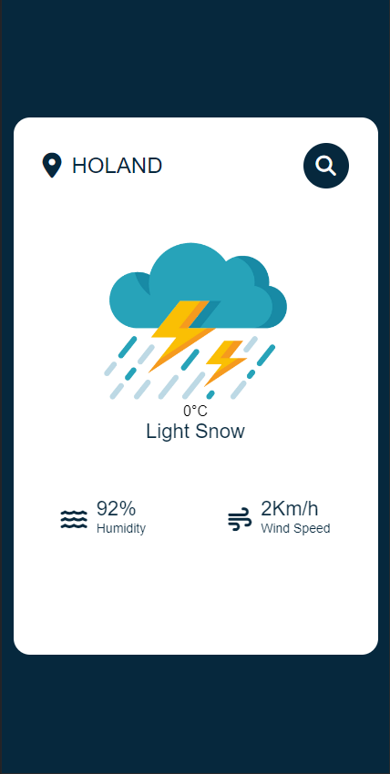

# Link do site
https://ahmad-el-eter.github.io/wheatherApp/

# Weather site
Este é um site que fornece informações sobre o clima em várias partes do mundo. Com base em dados meteorológicos em tempo real, este site oferece previsões precisas sobre a temperatura, umidade, velocidade do vento e outras variáveis climáticas em diferentes cidades.

# Objetivo
O objetivo do desenvolvimento deste site foi aprimorar o conhecimento em relação ao uso de APIs, desenvolvimento de interatividade e dinamismo em aplicações web, além de proporcionar a experiência de desenvolver uma aplicação que utiliza dados em tempo real e previsões do tempo para fornecer informações úteis aos usuários. O desenvolvimento deste site também foi uma oportunidade para o desenvolvedor aprender a estruturar e estilizar páginas web de forma responsiva e acessível para diferentes dispositivos e usuários.

# Funcionalidades
Este site oferece as seguintes funcionalidades:

Busca de cidades: os usuários podem pesquisar o clima de qualquer cidade do mundo. Basta digitar o nome da cidade na barra de busca e o site fornecerá as informações climáticas atuais.

Previsão do tempo: além das informações climáticas atuais, o site de clima também fornece previsões sobre a temperatura, umidade, velocidade do vento e outras variáveis climáticas.

# Tecnologias utilizadas
HTML/CSS: para a estruturação e estilização do site.  
JavaScript: para a criação de interatividade e dinamismo do site.  
APIs: o site utiliza APIs de fornecedores de dados meteorológicos para obter informações em tempo real e previsões do tempo.

# Imagens do projeto
  

# Como contribuir para este site
Se você deseja contribuir para o site de clima, pode enviar um e-mail para ahmad.aleterbr@gmail.com. Estou sempre aberto a sugestões e ideias para melhorar o projeto.
